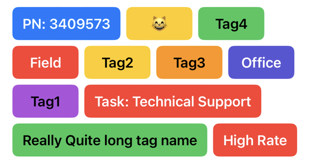
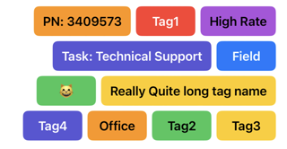
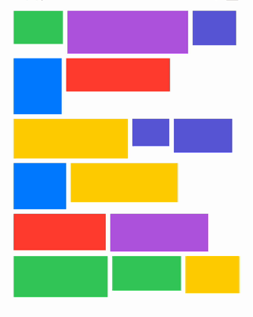
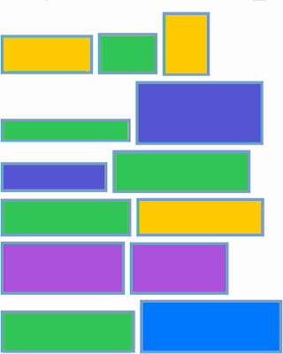

# Flow

[](https://swiftpackageindex.com/toastersocks/Flow)
[](https://swiftpackageindex.com/toastersocks/Flow)


---

A layout for placing views in a flow-like arrangement in SwiftUI. A `Flow` organizes views sequentially, wrapping them onto new lines when the current line is filled. The alignment and spacing between views can be customized. Flow layouts are commonly used to display a set of tags.






Using `Flow` is similar to using SwiftUI's VStack and HStack layouts/views.
Alignment and spacing changes can be animated and since Flow conforms to the `Layout` protocol you can even animate changing to an entirely different layout type!

## Usage

```swift
import Flow

struct ContentView: View {
    @State var tags: [Tag]

    var body: some View {
        Flow(alignment: .topLeading, spacing: 7) {
            ForEach(tags) { tag in
                TagView(tag)
            }
        }
    }
}
```

Check the [documentation](https://swiftpackageindex.com/toastersocks/Flow/documentation/flow) for more in-depth usage.

## Installing

### Swift Package Manager

#### Via Xcode

- Select your `.xcproject` file
- Select the project under `PROJECT`
- Select `Swift Package`
- Tap the `+` sign
- Paste this repo's address `https://github.com/toastersocks/Flow` into the text field and hit 'Next'
- Choose your version/branch on the next screen
- Choose your targets and hit 'Finish'
